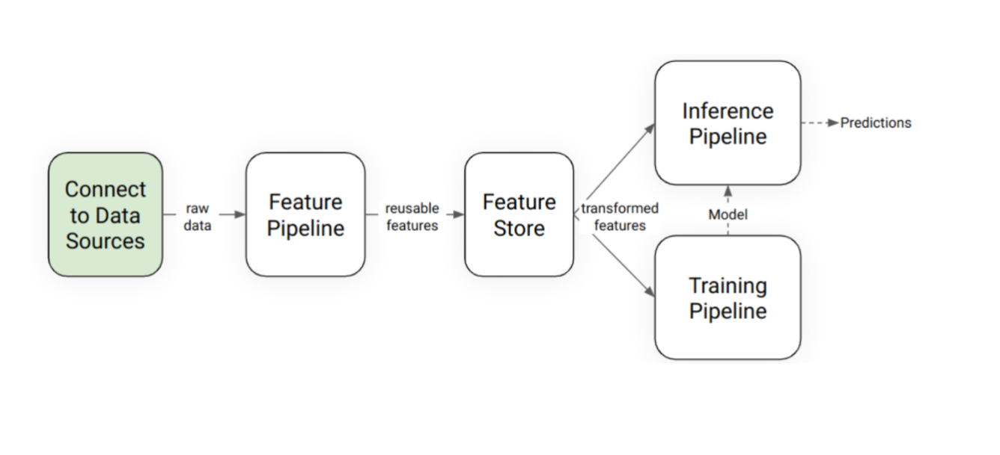
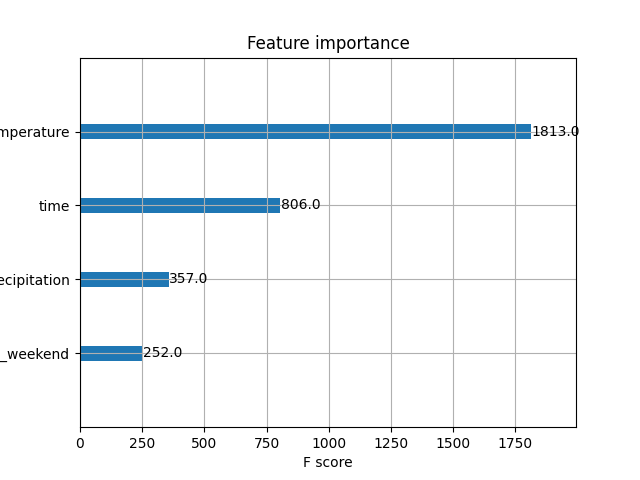
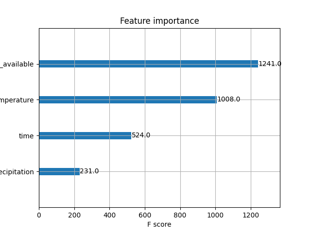
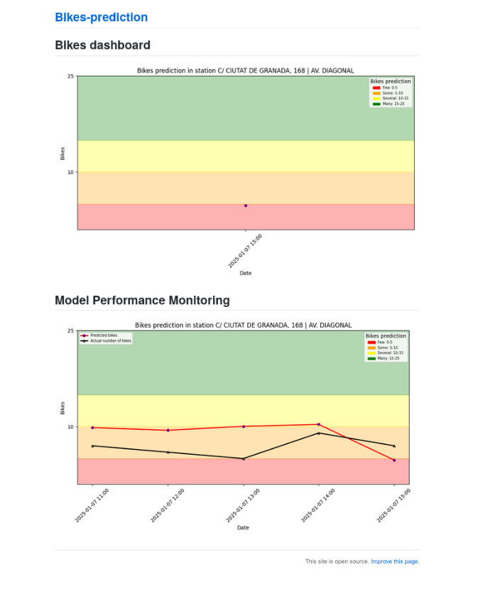

# Final project for ID2223 - Scalable Machine Learning and Deep Learning - KTH
Authors:
Júlia Tribo - juliatc@kth.se
Íñigo Aréjula - inigoaa@kth.se

## Description
Barcelona offers a public bike rental service that allows citizens to rent bikes for short periods of time. This service operates through a network of stations where users can pick up and return bikes. 

The objective of this project is to predict bike availability at stations within the city. To simplify the scope, this project focuses on a single station located at **C/ Ciutat de Granada, 168 | Av. Diagonal**.

## Dataset
This project utilizes both static and dynamic datasets:

- **Static Data**: This dataset is used for training the prediction model and contains information about the bike stations, such as:
  - Date and time
  - Number of available bikes
  - Weather information for Barcelona, retrieved the historical record using the [Open-Meteo API](https://open-meteo.com/en/docs)


- **Dynamic Data**: This dataset is used for making hourly predictions and includes:
  - Real-time availability of bikes at the station
  - Weather information for Barcelona, retrieved the current data using the [Open-Meteo API](https://open-meteo.com/en/docs)

All station-related data was sourced from the Barcelona City Council’s [open data service](https://opendata-ajuntament.barcelona.cat/data/es/dataset/estat-estacions-bicing/resource/e5ed1e52-b205-49ff-b99c-a2307a8ce9a3?inner_span=True).


## Architecture

Our architecture is devided in four components:
### Feature pipeline
This pipeline is responsible for generating the features that will be used in the training and inference pipelines. It is implemented of two notebooks:
- `bike_feature_backfill.ipynb`: This pipeline is responsible for reading the historical data from the CSV download from the Barcelona City Council’s open data service and the weather data from the Open-Meteo API. 
- `bike_feature_pipeline.ipynb`: This pipeline is responsible for reading the real-time data from the Barcelona City Council’s open data service and the weather data from the Open-Meteo API and update the feature store. This must be run hourly to update the feature store.

With this data it will generate a data frame and it will save it remotly on the Hopsworks feature store. The feature groups are:
- `bikes`: This dataset contains the historical data of the bikes availability at the station.
- `weather`: This dataset contains the historical weather data for Barcelona.
- `bikes_predictions`: This dataset contains the data that will be used for monitoring the model, it is created and populated on the inference pipeline.


#### Bikes feature group
| Name                     | Description                                              | Type     |
|----------------------------|----------------------------------------------------------|----------|
| day                        | Day of measurement of bikes availability                 | object |
| time                       | Hour of measurement of bikes availability                | int64 |
| num_bikes_available        | Available bikes at the station                           | int64 |
| prev_num_bikes_available   | Bikes available the station during the previous hour     | float32 |
| ate                       | Last time the data was updated                           | datetime64[ns, UTC]  |
| is_weekend                 | Boolean if the date is a weekend                         | boolean  |

#### Weather feature group
| Nombre         | Descripción                                  | Tipo                 |
|----------------|----------------------------------------------|----------------------|
| date           | Date of measurement of weather              | datetime64[ns, UTC] |
| day            | Day of measurement of weather               | object              |
| time           | Time of measurement of weather              | int64               |
| city           | City where weather is measured/forecast for | object              |
| precipitation  | Precipitation (rain/snow) in mm             | float32             |
| temperature    | Temperature in Celsius 2m above ground      | float32             |


#### bikes_predictions feature group
| Name                          | Description                                           | Type       |
|-------------------------------|-------------------------------------------------------|------------|
| date                          | Date of measurement of weather                       | datetime64[ns, UTC]  |
| precipitation                 | Precipitation (rain/snow) in mm                      | float32      |
| temperature                   | Temperature in Celsius 2m above ground              | float32      |
| city                          | City where weather is measured/forecast for          | object     |
| time                          | Time of measurement of weather                       | int64     |
| day                           | Day of measurement of weather                        | object     |
| is_weekend                    | Boolean if the date is a weekend                     | boolean    |
| is_holiday                    | Boolean if the date is a holiday                     | boolean    |
| prev_num_bikes_available      | Bikes available at the station during the previous hour | int64     |
| predicted_num_bikes_available | Predicted available bikes at the station             | float32      |


### Feature store
We use Hopsworks feature store to store the features generated by the feature pipeline. The feature store is used to store the features that will be used in the training and inference pipelines. We also use Hopsworks to store the models.
### Training pipeline
This pipeline is responsible for training the model that will be used in the inference pipeline. It is implemented in the `3_bike_training_pipeline.ipynb` notebook. The pipeline reads the data from the feature store and trains a model using the historical data. The model is then saved in the Hopsworks model registry.
#### First approach
Our first approach was to use XGBoost to predict the number of bikes available at the station. We used the following features:

- `temperature`: Temperature in Celsius 2m above ground
- `precipitation`: Precipitation (rain/snow) in mm
- `time`: Hour of measurement of bikes availability
- `is_holiday`: Boolean if the date is a holiday, we obtained this information from the `holidays` library
- `is_weekend`: Boolean if the date is a weekend

After training the model, we obtained the following results:
- R squared: 0.3459
- MSE: 22.364



#### Second approach
Our second approach was to improve the model by adding one more feature that we consider it might be fundamental for the prediction: the number of bikes available at the station during the previous hour. We used the following features:

- `temperature`: Temperature in Celsius 2m above ground
- `precipitation`: Precipitation (rain/snow) in mm
- `time`: Hour of measurement of bikes availability
- `is_holiday`: Boolean if the date is a holiday, we obtained this information from the `holidays` library
- `is_weekend`: Boolean if the date is a weekend
- `prev_num_bikes_available`: Bikes available at the station during the previous hour

After training the model, we obtained the following results:
- R squared: 0.6728
- MSE: 13.24



### Inference pipeline

This pipeline will be executed in Github actions hourly to predict the number of bikes available at the station. It is implemented in the `4_bike_inference_pipeline.ipynb` notebook. The pipeline reads the data from the feature store and uses the trained model to predict the number of bikes available at the station. The predictions are then saved in the feature store.

It will also generate the images that will be used in the dashboard.

## Dashboard
For showing the prediction we use a static site generated by github action.  The site is generated using the `index.md` file and the images generated by the inference pipeline. The site is available at the following link: [https://juliatribo.github.io/Bikes-prediction/](https://juliatribo.github.io/Bikes-prediction/)


## Results
After comparing both models we can see that the second model is better than the first one. The second model has a higher R squared and a lower MSE. This means that the second model is better at predicting the number of bikes available at the station.

We can also see that the most important feature for the prediction is the number of bikes available at the station during the previous hour. This makes sense since the number of bikes available at the station during the previous hour is a good indicator of the number of bikes that will be available at the station in the next hour. 

Followed by the temperature and the time of the day. This also makes sense since the temperature and the time of the day can affect the number of bikes available at the station. For example, if the temperature is very low, people might not want to rent a bike. Similarly, if it is very late at night, people might not want to rent a bike.

## How to run the code

For running the code, you need to have to install the requirements in the requirements.txt file. You can do this by running the following command:

```
pip install -r requirements.txt
```

Then, you can run the code inside vscode as a jupyter notebook.